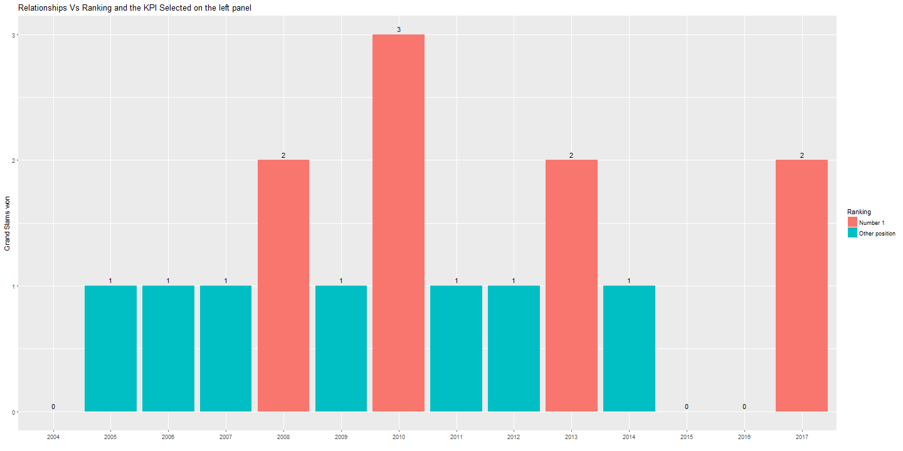

Rafa Nadal Ranking  Predictor
========================================================
author: Pedro A. Alonso Baigorri
date: 17/05/2018
width: 1440
height: 900
font-family: 'Calibri'

Objective
========================================================

As everybody knows, Rafa Nadal it's probably the best tennis player ever (at least in clay).
But, despite of his brilliant career, he got to finish the year as Number #1 in the ranking of the ATP only in 4 years (2008, 2010, 2013, 2017).

Although becoming Number #1 depends not only of personal performance but also what the competitors does, I would like to try if analyzing the historical data of won tournaments, we can predict what will be happen this year through an app that can simulate a certain number of tournaments won.

The application designed, will provide then 2 different tabs with the following functionality:

* A tab showing the analysis of the ranking position versus the different type of achievements in the year
* A tab with a simulator of victories to predict the ranking position on this year.

Dataset
========================================================

I created a dataset with the historical achievements of Rafa Nadal with the official data provided by ATP through:
http://www.atpworldtour.com/es/players/rafael-nadal/n409/titles-and-finals

Here you can see this dataset:


```r
file <- "RNadal_Ranking/data/rnadal_statistics.csv"
rnadal_data <- read.table(file, header = TRUE, sep = ";")
head(rnadal_data)
```

```
  year total_won_tournaments total_finals won_grand_slams
1 2017                     6            4               2
2 2016                     2            1               0
3 2015                     3            3               0
4 2014                     4            3               1
5 2013                    10            4               2
6 2012                     4            1               1
  finals_grand_slams ranking_eoy n1_eoy
1                  1           1      1
2                  0           9      0
3                  0           5      0
4                  1           3      0
5                  0           1      1
6                  1           4      0
```

Tournament Analysis
========================================================

Then in the tournament analysis tab, the user can select the type of achievement to analyze the relationship between this KPI and the ranking posistion at the end of the year.

As an example the following plot shows Number of Grand Slams Won



Ranking Predictor
========================================================

In the  Ranking Predictor tool, I train a glm model to try to predict the ranking position on this year, according to the simulation of victories that the user can input through the control panel.

As an example when the user select 2 or more Grand Slams Won the predictor gives the following result:


```
[1] "Yes !!, I'm the number one !!"
```

